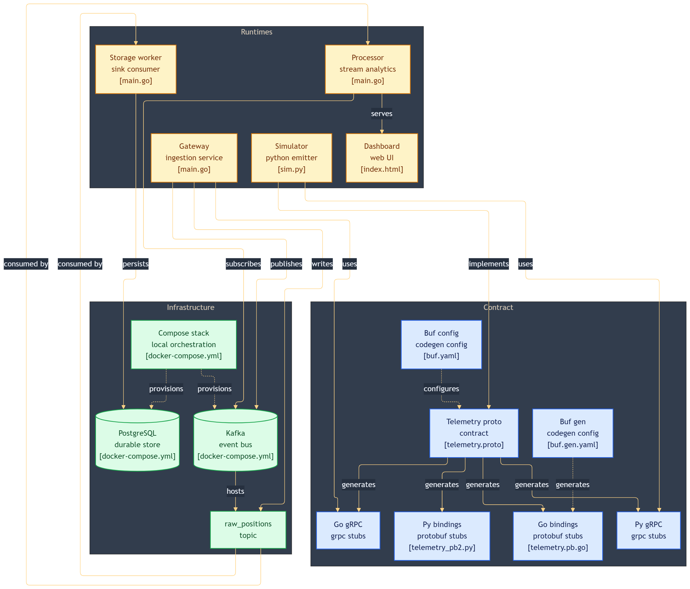

Got it. My apologies—I blindly copied the E-commerce example formatting you pasted instead of adapting the tags and image path strictly for *our* Fleet Tracking stack.

Here is the exact, customized Markdown code for your project. I have updated the image source to point to `./assets/fleet-tracking-platform.png` (which perfectly matches your local folder structure) and swapped the badges out for our exact tech stack (Go, Python, Docker, Kafka, gRPC, PostgreSQL, and Leaflet).

Copy and paste this directly into your `README.md`:

```markdown
# High-Throughput Real-Time Fleet Tracking Cluster

<p align="left">
  
  
  
  
  
  
  
</p>

A production-grade, highly resilient distributed system architected using Go, Python, PostgreSQL, and Apache Kafka. The entire stack is containerized using Docker across isolated networks, leveraging gRPC for ultra-fast binary serialization, and WebSockets for real-time frontend geospatial rendering.

---

## 🗺️ Architectural Topology & Event Mesh

<p align="center">
  
</p>

This platform uses asynchronous event-driven patterns to decouple edge API gRPC ingestion traffic from heavy analytical alerting lifecycles and permanent relational database persistence.

```text
[Python IoT Simulator] 
         │  (gRPC / Protocol Buffers Binary Serialization)
         ▼
[Go Ingestion Gateway] (:50051)
         │  (Partition-balanced hashing by vehicle_id)
         ▼
[Apache Kafka Broker] (:9092) ── Topic: raw_positions (3 Partitions)
         │
         ├──► Group: fleet-cep-final-group ──► [Go CEP Engine & UI Server] (:8080) ──► (WebSockets) ──► [Leaflet.js Dashboard Map]
         │
         └──► Group: fleet-storage-persistent-group ──► [Go Storage Worker] ──► [PostgreSQL Database] (:5433)

```

---

## 📂 Project Structure

```text
fleet-tracking-platform/
├── docker-compose.yml      # Core Infrastructure (Kafka, Postgres, Kafdrop)
├── gateway/                # Ingestion Edge (gRPC Entrypoint)
│   ├── proto/
│   │   └── telemetry.proto # Protocol Buffer interface contract
│   └── main.go
├── simulator/              # Python IoT Telemetry Simulator
│   └── sim.py
├── processor/              # Stateful Stream Processing (CEP) & UI Server
│   ├── index.html          # Leaflet.js Interactive UI Map
│   └── main.go
└── storage-worker/         # Relational Persistence Service
    └── main.go

```

---

## 🚀 Quick Start Pipeline Execution

### 1. Boot Infrastructure & Create Stream Topic

```bash
# Spin up containers
docker compose up -d --force-recreate

# Provision Kafka partitions
docker exec -it kafka /usr/bin/kafka-topics --create --topic raw_positions --bootstrap-server localhost:9092 --partitions 3 --replication-factor 1

```

### 2. Run Application Microservices

Open four separate terminal windows to launch the data pipeline concurrently:

* **Terminal 1: Ingestion Edge**
```bash
cd gateway && go mod tidy && go run .

```


* **Terminal 2: Storage Worker**
```bash
cd storage-worker && go mod tidy && go run .

```


* **Terminal 3: Stream Processor & UI Server**
```bash
cd processor && go mod tidy && go run .

```


* **Terminal 4: IoT Fleet Simulator**
```bash
cd simulator && python sim.py

```


---

## 🔍 Visual Verification Hubs

* **Operational Control Dashboard:** Open `http://localhost:8080` to view the dark-mode interactive map tracking vehicle marker locations dynamically.
* **Kafka Cluster Metrics:** Open `http://localhost:9000` to audit partition offsets and consumer group metrics via Kafdrop.
* **Relational Storage Audit:** Connect to `localhost:5433` using credentials `fleet_admin` / `fleet_password` to query time-series records inside the `fleet_telemetry` database.

```

```